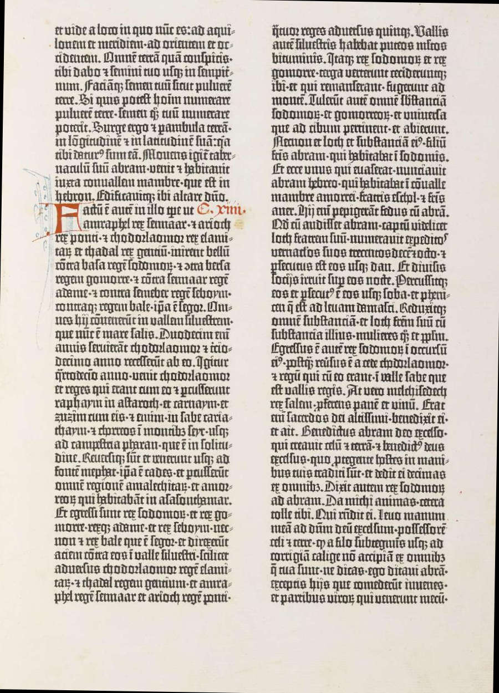
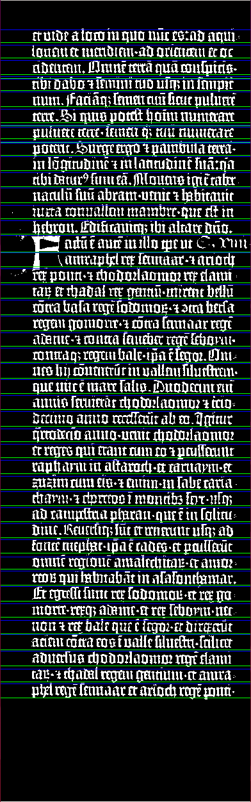

# HolySheet
Word crawler for ancient documents. This software provides methods for binarization and word segmentation of ancient 
document, like Genesis (from Holy Bible). In particular it can:
                                    
- **Elaborate .png scans of ancient document with python libraries like openCV**
                                    
- **Get word segmentation, using histogram pixel techniques and specific heuristics**
                                    
- **Prepare a dataset for Detectron neural network**

To achieve that we process an image in several ways: first, we perform a rotation in order to straighten it up. Through 
OpenCV's threshold() method, our image becomes binarized. An image

 

Original <b>Genesis</b> image and binarization. 

After that, we make a histogram so that we can obtain a segmentation of the single line.

<b>Line</b> segmentation.

Finally, we repeat the histogram and we affine the results through another method call, calimero(), which helps us 
spotting the periods and the full stops. This way we obtain the single word segmentation.

<b>Word</b> segmentation

Moreover the software can split the images into sub-images and generate the annotations for them, making them suitable 
for a COCO-based neural network.